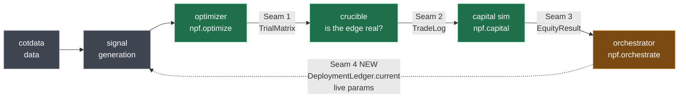
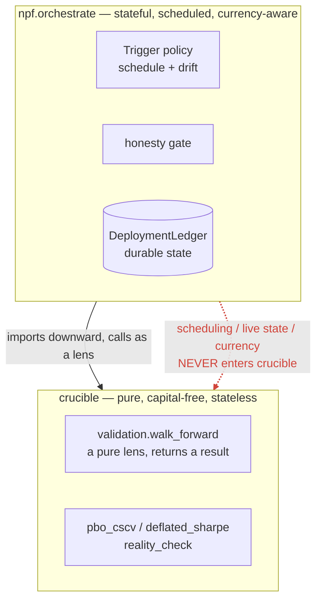
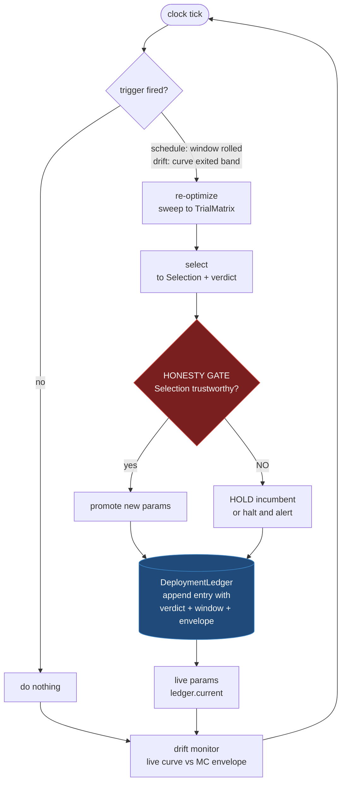
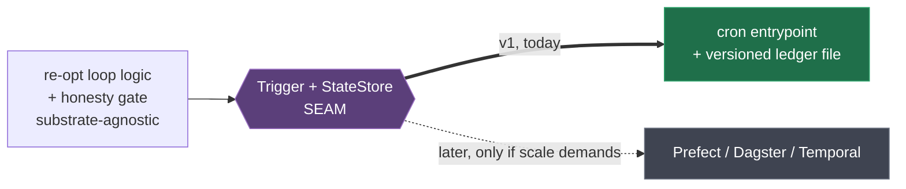

# ADR-0003: The deployment orchestrator as a stateful re-optimization loop

> **Provenance.** This ADR was written in the private `npf` repository before the framework
> was extracted (ADR-0004), and it is preserved here as the decision record for code that now
> lives in this repo. The reasoning is unchanged and still current. Module paths in the body
> are the pre-move ones, and map as follows:
>
> | as written | today |
> |---|---|
> | `npf.optimize` | `crucible_stack.optimize` |
> | `npf.capital` | `crucible_stack.capital` |
> | `npf.orchestrate` | `crucible_stack.orchestrate` |
> | `npf.framework` | `crucible_stack.framework` |
> | `npf.strategies.simulator` / `.exits` | `crucible_stack.engine.simulator` / `.exits` |
>
> References to `npf` books, COT strategies and the `cotdata` store are examples from the
> repo where this was written. They are not requirements of this framework, which ships with
> no strategy at all.

**Status:** Accepted
**Date:** 2026-07-20 (accepted 2026-07-21)
**Deciders:** Matt (sole maintainer)

> **Accepted 2026-07-21.** The trust boundary in action item 8 was put explicitly and
> confirmed: this loop is authorized to *act* on live trading — to write the parameter set a
> live system reads — subject to the honesty gate, which may only promote a `Selection` the
> optimizer marked trustworthy.
>
> Acceptance is of the **design and the authorization**, not a statement that anything is
> deployed. At acceptance no book had ever been promoted: the Gold book sits at deflated
> Sharpe 92% against a 95% bar with a FRAGILE reality check, so the gate refuses it and the
> loop halts. Everything downstream of a successful promotion — including the drift monitor
> watching a live incumbent — remains exercised only by tests until some book clears the bar.
**Builds on ADR-0001** (in the private strategy repo) (the wrapped engine
it composes for layers 2–3) and **ADR-0002** (likewise private)
(the honest-N ledger the loop's gate depends on). Companion to
[seam-contracts.md](../design/seam-contracts.md), which this ADR extends with a fourth contract.

## Context

The toolchain is the flow **cotdata → signal → optimizer → crucible → capital sim →
orchestrator**. Layer 1 (optimizer/`npf.optimize`) is built; layer 2 (capital/`npf.capital`) is
mostly built. **Layer 3 — the deployment orchestrator — has zero design committed.** This ADR
opens it.

The orchestrator is the reframing the whole project turned on (project memory
`pardo-toolchain-siblings.md`): Bob Pardo's Walk-Forward Analysis is **not a one-time validation
gate — it is a live re-optimization operating system.** Periodically re-optimize on a rolling
window, roll the winning parameters forward into live trading, and repeat. The orchestrator is
that operating system: stateful, scheduled, long-lived. It holds the **live parameter set**,
decides **when to re-optimize**, and monitors **live-versus-sim drift**.

**Everything it orchestrates already exists behind seams, and it adds no new math.** The
optimizer emits a `TrialMatrix` and an honest `Selection`; crucible prices the search
(`pbo_cscv` / `deflated_sharpe` / `reality_check`); the capital sim emits an `EquityResult` and
an MC envelope (`equity_bands` / `portfolio_mc`). The orchestrator is the **controller** that
runs this pipeline on a clock, persists the chosen parameters with their provenance, and watches
the live account against the envelope it was provisioned within. What it contributes is not a
function — it is **state, time, and control flow**.

**The one categorically new property is statefulness that acts.** Layers 1–2 are pure: a
`TradeLog` goes in, a result comes out, nothing persists. The orchestrator holds mutable,
durable state (the current param set, the roll-forward history, the live-vs-sim comparison) and
— uniquely in the stack — it can *act*: what it writes is what a live system reads to trade. That
inverts the trust boundary. A pure lens that is wrong produces a misleading chart; an
orchestrator that is wrong **deploys a bad parameter set into a live book.** Correctness,
auditability, and reversibility are therefore load-bearing here in a way they never were for the
analysis layers.

**This is where the boundary guardrail bites.** crucible already has
`crucible.validation.walk_forward` — but that is a **pure lens**: `strategy + prices + param_grid
→ WalkForwardResult`, stateless, capital-free, no persistence, no clock. The standing guardrail
(memory): *resist letting the WFA loop sneak equity/capital logic or live state back into
crucible.* The orchestrator is precisely where scheduling, currency, and live state live — and it
must live **structurally outside crucible**, composing `walk_forward` as one lens among many, never
absorbing the loop into it.

**Forces at play:**

- **Statefulness changes the software category.** Layers 1–2 ship as libraries (import, call,
  discard). The orchestrator is a *service/daemon* with durable state and a schedule. Different
  category, different failure modes (stale state, missed runs, partial writes), different
  correctness bar.
- **It can act, so honesty must be enforced at the gate, not assumed.** The loop's promote step
  is the one place in the stack where a statistical verdict turns into a live position size. If
  the loop ever deploys a param set the optimizer flagged NOT trustworthy, every honesty
  investment upstream is voided at the last inch. The gate is the point.
- **Solo maintainer + private tooling.** Like ADR-0001, build-vs-adopt leans toward wrapping
  mature tools. Scheduling, retries, durable state, and observability are exactly what workflow
  engines already solve; reinventing a scheduler is as poor a use of the only engineer as
  reinventing a backtester was for layer 2.
- **...but the operational scale is tiny.** This is single-user, private, and *low-frequency* —
  Pardo's WFA windows are months; re-optimization is weekly-to-monthly, not per-tick. A daemon
  farm is not warranted. A cron entry plus a state file may fully cover v1. The build-vs-adopt
  call must weigh a heavy engine's ceremony against a scale that barely needs it.
- **Reversibility is the same lever as ADR-0001.** The engine there hides behind a seam so it can
  be swapped without a rewrite. The scheduling substrate here should hide behind a **trigger
  seam** for the same reason: start minimal, and if frequency/complexity ever demand a real
  workflow engine, slot it in without touching the loop's logic or the honesty gate.

## The picture

**The toolchain, with the loop closed.** `seam-contracts.md` draws the stack as a straight line
ending at the orchestrator. That line is only half the story: the orchestrator's whole point is
the **feedback edge** that turns a pipeline into an operating system.

Green = built. Amber = this ADR. The dashed edge is the one this ADR creates, and it is what makes
layer 3 categorically different: **output re-enters the stack as input.**

**The boundary that must hold.** Commitment 5, drawn. The orchestrator imports downward and may
call `walk_forward` as a lens. Scheduling, state, and currency never travel the other way.

## Decision

Establish the deployment orchestrator as a **stateful private sibling** (`npf.orchestrate`, home
TBD — see action items) that composes the existing seams into a scheduled re-optimization loop.
It is defined by five commitments:

1. **A live-deployment state it owns and persists — the fourth seam.** Introduce a
   `DeploymentLedger`: an append-only record of every parameter roll-forward, each entry carrying
   the params, the `Selection` verdict that gated it, the window it was fit on, and the sim
   envelope it was provisioned within. `ledger.current()` returns the live set. This mirrors
   `SearchSpaceLog`'s append-only-ledger idiom (ADR-0002) deliberately: an auditable history, not
   a mutable current-value blob. It is the currency/live-world twin of `EquityResult`, and it
   **closes the loop** — its output feeds back to signal/optimizer as the live parameters.

2. **The re-optimization trigger is a first-class, pluggable policy**, not hardcoded. Two honest
   triggers, composable: **schedule-driven** (Pardo's baseline — re-opt every N periods as the
   OOS window rolls) and **drift-driven** (re-opt early when the live account escapes its sim
   envelope). Recommend **hybrid**: scheduled cadence as the floor, drift as an early interrupt.

3. **The drift monitor uses the sim's own envelope, not an ad-hoc threshold.** The capital layer
   already produces a block-bootstrap MC envelope (`equity_bands` / `portfolio_mc`: terminal CI,
   max-dd CI, P(ruin)). Drift = the *realized* live curve escaping the band it was provisioned
   within (e.g. realized drawdown breaching the p95 max-dd the sim predicted). This keeps drift
   detection on the same significance discipline as the rest of the stack — live-vs-sim is a
   band-exit event, not a hand-tuned tripwire.

4. **A hard honesty gate on promotion.** The loop may promote a re-optimized param set **only if
   the optimizer's `Selection` marks it trustworthy.** A NOT-trustworthy re-opt **holds the
   incumbent** (or halts and alerts) — it never auto-deploys. This is the loop's crucible-stays-MIT
   invariant: the non-negotiable that every option below must preserve.

5. **Structural separation from `crucible.validation.walk_forward`.** The orchestrator *may call*
   `walk_forward` as a pure lens, but scheduling, currency, and live state never enter crucible.
   CI-enforceable in the same spirit as ADR-0001's zero-vbtpro-import guard: crucible gains no
   orchestration concept.

**The loop, with the gate on it.** Everything above assembles into one cycle. Note where the
diamond sits: **no path reaches "promote" except through the honesty gate**, and the "hold" path
is a first-class outcome that still writes to the ledger, so a refusal to deploy is as auditable
as a deployment.

**Substrate (the build-vs-adopt call): start minimal behind a trigger seam.** Implement v1 on
**cron + a versioned state file** (Option A below), with the trigger and state-store hidden behind
seams so a workflow engine (Prefect/Dagster/Temporal) can replace the substrate later without
touching the loop logic or the gate. This is the ADR-0001 move applied to scheduling: adopt the
mature tool *when the scale demands it*, not before, and make the swap cheap by design.

## Options Considered

The options below are about the **substrate** — how the loop is scheduled, persisted, and run.
The five commitments above (especially the honesty gate and the crucible boundary) are invariant
across all of them.

### Option A: cron + versioned state file, behind a trigger seam (recommended for v1)

A thin Python entrypoint the OS scheduler invokes; the `DeploymentLedger` persists as versioned
JSONL/JSON (the `SearchSpaceLog` idiom). The trigger and state-store sit behind seams.

| Dimension | Assessment |
|-----------|------------|
| Complexity | Low — one entrypoint + a ledger file; no infra |
| Cost | Zero new deps; stdlib + existing siblings |
| Operational fit | Matches weekly/monthly, single-user, private scale exactly |
| Observability | Weakest — logs + the ledger; no built-in run history UI |
| Reversibility | High — trigger seam lets a real engine slot in later |

**Pros:** Nothing to stand up or maintain; the scale genuinely needs nothing more; the ledger is
the audit trail; consistent with the project's stdlib-ledger idiom; the seam keeps the upgrade
path open (mirrors ADR-0001's swappable engine).
**Cons:** No free retries/backfill/observability — hand-rolled if needed; cron misfires are
silent unless the entrypoint self-checks for a missed window; state-file concurrency is on you
(mitigated by single-user, low-frequency, and the editable-install lesson from ADR-0002 — a lock
or atomic write is cheap insurance).

### Option B: adopt a workflow engine now (Prefect / Dagster / Temporal)

Model the loop as a scheduled flow/DAG with the engine owning scheduling, retries, run history,
and durable state.

| Dimension | Assessment |
|-----------|------------|
| Complexity | High — infra to run and maintain for one user |
| Cost | Heavy dep; a service to operate (or a hosted tier) |
| Operational fit | Overbuilt for weekly/monthly single-user runs |
| Observability | Strong — run history, retries, alerting out of the box |
| Reversibility | Lower — the loop tends to fuse to the engine's programming model |

**Pros:** Real scheduling semantics, retries, backfill, and a run-history UI for free; the right
answer *if* this ever runs many books at higher frequency with uptime requirements.
**Cons:** Large operational surface for a solo maintainer at trivial scale; the loop risks fusing
to the engine's DAG model (the exact "engine becomes identity" failure ADR-0001 warns against);
pays maturity cost now for a scale that does not exist yet.

### Option C: build a bespoke long-running daemon

A custom scheduler/event-loop process holding state in memory, persisting periodically.

| Dimension | Assessment |
|-----------|------------|
| Complexity | High — reinventing scheduling, persistence, recovery |
| Cost | High eng time; contradicts wrap-don't-rebuild |
| Operational fit | A daemon for monthly events is the wrong shape |
| Observability | Whatever you build |
| Reversibility | Low — bespoke machinery is what you'd rip out |

**Pros:** Full control; no external scheduler dependency.
**Cons:** Rebuilds precisely the undifferentiated plumbing (scheduling, crash recovery, durable
state) that both cron and workflow engines already solve; a resident process is the wrong
footprint for infrequent, discrete re-opt events; directly contradicts the wrap-don't-rebuild
principle recorded for layer 2.

## Trade-off Analysis

The substrate tension is **operational scale (A) vs. operational maturity (B) vs. control (C)**,
and it resolves the mirror image of ADR-0001. There, build-vs-wrap favored *wrapping* a mature
engine because vectorized backtesting is hard and the scale is real. Here, the scale is *trivial*
(single-user, monthly), so the maturity a workflow engine buys is capacity the project will not
use for a long time — and adopting it now pays ceremony up front and risks the loop fusing to a
DAG model, the same "engine as identity" trap ADR-0001 fought. C loses for the reason C lost in
ADR-0001: rebuilding undifferentiated plumbing is the wrong use of the only engineer.

A wins **for v1 specifically** because it is the smallest thing that fully covers the actual
workload, it reuses the append-only-ledger idiom the project already trusts, and — decisively —
the **trigger seam makes B reversible.** The genuine risk of A (thin observability) is bounded by
scale: with a monthly cadence and an append-only ledger, "what did the loop do and why" is
answerable from the ledger without a run-history UI. If the workload ever grows into B's regime
(many books, higher frequency, uptime requirements), the seam lets the engine slot behind the
same loop logic — a *partial defection* exactly like ADR-0001's per-layer escape hatch.

**What the seam buys, drawn.** The reversibility claim is the whole reason A beats B *for now*.
The loop logic and the gate never learn what schedules them:

The decisive invariant, independent of substrate, is the **honesty gate (commitment 4).** It is
this ADR's "crucible must stay MIT": the loop exists to carry the stack's significance discipline
all the way into deployment, so the one thing it must never do is promote a param set the
optimizer flagged untrustworthy. Every option preserves it or is rejected. The gate — not the
scheduler — is what makes this "Pardo's operating system, but statistically honest at every gate."

## The promotion path (what may later move into crucible)

Commitment 5 draws a hard boundary, but **the boundary is a filter, not a freeze.** It has already
moved *inbound* twice: `SearchSpaceLog` came from npf (ADR-0002), and the eight tearsheet panels
were promoted out of npf into `crucible.report` (crucible #79/#80/#83). The policy those two
promotions actually established is worth stating plainly, because it governs this layer too:

> **Capital-free honesty primitives go public into crucible. The machinery that composes them
> stays private in the siblings.**

**Orchestration fails that test on two axes, and the second is the one that disqualifies it.**
The stated invariant is *capital-free*, which the loop obviously violates (it is currency-
denominated end to end). But this ADR surfaces a second axis: **crucible is a library of pure
lenses, and the orchestrator is a service** — it owns a clock, durable state, and side effects on
a live book. That is a different software category with a different testing story, release
cadence, and support obligation. Bundling a scheduler into a `pip install`-able MIT library whose
entire core dependency set is `numpy` + `pandas` would be wrong **even if the loop were
denominated in R.** Statefulness alone is disqualifying.

**Promotable in principle — design them so they *can* move:**

- **The drift core (strongest candidate).** "Did the realized sequence escape the envelope the
  validated edge predicted?" is, *expressed in R-space*, a pure function of two arrays: capital-
  free, stateless, and built on block-bootstrap machinery crucible already owns. It is the same
  significance discipline applied to live data instead of backtest data — squarely crucible's
  remit, and arguably the most differentiated public capability in this entire design. Nobody
  ships "has my edge statistically decayed?" as a capital-free lens.
- **The promotion predicate.** `is_promotable(selection) -> bool` is a pure verdict-over-a-verdict.
  The *policy* is crucible-shaped; the *act* of promoting is not.
- **A rolling-re-opt summarizer.** PBO per re-opt and degradation across windows is a pure lens
  over a sequence of results, with `validation.walk_forward` as precedent.

**Never promotable, under any future:** the clock/trigger, the `DeploymentLedger` write path and
its durable state, anything currency-denominated, and the act of touching a live book.

**The binding constraint this section imposes.** Build the drift core **R-space and capital-free
from day one**, with the currency/envelope comparison as a thin orchestrator-side shell over it.
If it is written currency-coupled merely because that is where the equity curve happens to live,
it is **stranded in the private sibling permanently** — a promotable primitive lost to an
incidental implementation choice. This costs nothing now and is expensive to retrofit.

**If the *name* should eventually cover the stack, use extras, not absorption.** The pattern is
already in `pyproject.toml`: `data = ["cotdata>=0.1"]` reaches a sibling package *through*
crucible without crucible absorbing it. A future `crucible[orchestrate]` could pull a separate
distribution so users get one name and one story while core stays `numpy` + `pandas` and MIT.
"crucible provides orchestration" can become true at the **project** level without ever becoming
true at the **package** level.

**The counterweight, recorded deliberately.** The capital-free wedge is the only genuinely
differentiated piece of this stack; a crucible that also schedules and trades competes with
QuantConnect and RealTest, the red ocean a solo maintainer cannot win. mlfinlab is the cautionary
case in the same niche — scope broadened, OSS languished. Promotions must clear the filter one at
a time, on merit. **Scope creep into crucible is the failure mode this section exists to prevent,
not a roadmap it endorses.**

## Consequences

**What becomes easier:**
- The stack finally *closes the loop* — validated params flow to live trading and back, on a
  schedule, with an audit trail, instead of a manual re-fit ritual.
- Drift is measured against the sim's own MC envelope, so "is live behaving like the sim
  promised" becomes a first-class, honest signal rather than eyeballing an equity curve.
- Re-optimization cadence and drift-trigger policy are pluggable, so the schedule-vs-drift
  question can be tuned empirically without touching the loop.
- The `DeploymentLedger` gives a complete provenance chain: every live param set traces to the
  re-opt, the verdict, and the window that produced it.

**What becomes harder / must be done carefully:**
- **Stateful software raises the correctness bar.** Missed windows, partial writes, and stale
  state are new failure modes with no analog in layers 1–2. The entrypoint must self-check for a
  missed window and write the ledger atomically (heed the ADR-0002 editable-install lesson: a
  global-looking state file bites hardest when you assume isolation).
- **The honesty gate must be un-bypassable, and tested as such.** A test must assert that a
  NOT-trustworthy `Selection` cannot promote — the gate is the load-bearing safety property.
- **The crucible boundary needs a guard.** Add a CI check that `npf.orchestrate` may import
  crucible but crucible gains no orchestration/scheduling/state import — the ADR-0001 pattern.
- **Reversibility is only real if the seams stay clean.** If cron specifics or ledger-file format
  leak into the loop logic, Option B stops being a cheap swap. Keep the trigger and state-store
  behind interfaces from day one.

**To revisit:**
- **Substrate upgrade trigger.** If the workload grows to many books / higher frequency / uptime
  requirements, revisit A→B and slot a workflow engine behind the trigger seam.
- **Repo home.** v1 leans `npf.orchestrate` (private, alongside `npf.optimize` / `npf.capital`),
  but a *live-trading controller* is a different animal from a research library — if it grows a
  real runtime footprint, a dedicated private repo may be warranted (echoes ADR-0001 action
  item #5). Decide before it accretes.
- **The live→sim feedback edge** (orchestrator's live params re-entering signal generation) is
  drawn here but not specified; it needs its own pass once the ledger exists.

## Action Items

1. [x] Specify the **`DeploymentLedger`** contract, matching the `SearchSpaceLog` idiom:
       entries of (params, `Selection` verdict, fit-window, sim-envelope ref, timestamp);
       `current()` accessor; in-memory default with opt-in persistence. **DONE 2026-07-20** —
       added to [seam-contracts.md](../design/seam-contracts.md) as **Seam 4**.
       *Refined during specification, two deviations from this ADR's own wording:*
       (a) split into a **frozen `DeploymentEntry` + a mutable append-only `DeploymentLedger`**
       rather than one frozen dataclass — the ledger *is* state, so `SearchSpaceLog`'s mutable-
       ledger idiom fits where `TradeLog`'s frozen-frame idiom does not;
       (b) `current()` is **derived** from the history (most recent `promote`), never stored
       alongside it, so the live param set cannot diverge from the record justifying it.
       Also surfaced a trap worth reading before implementing: the **envelope must be a frozen
       snapshot** taken at promotion, because recomputing it re-baselines onto drifted reality
       and yields a drift monitor structurally incapable of firing. Implementation still open.
2. [x] Define the **trigger seam**: a `Trigger` Protocol with `schedule` and `drift`
       implementations and a `hybrid` composition; the loop depends on the Protocol, never on
       cron/engine specifics. **DONE 2026-07-20** — `npf/src/orchestrate/trigger.py`
       (`TriggerContext`, `TriggerDecision`, `Trigger` Protocol, `ScheduleTrigger`,
       `DriftTrigger`, `any_of`); `tests/test_trigger.py`, 17 tests. Suite 322 passed.
       - **Triggers fail OPEN; the gate fails CLOSED.** Deliberate asymmetry, and worth stating
         because it looks inconsistent. What the gate cannot confirm as trustworthy it refuses
         to deploy. What a trigger cannot assess (e.g. no envelope attached) it *re-checks* —
         firing only runs the optimizer, and the gate still stands between that result and a
         live book, so a spurious re-optimization is bounded. Not free, though: every re-opt
         adds variants to the `SearchSpaceLog` and so enlarges the multiple-testing
         denominator. A trigger firing constantly quietly taxes the verdict it exists to
         refresh, which is why blind-but-firing carries an explicit loud reason.
       - **Cold start fires under every policy** — nothing live means nothing to preserve, so
         a `cadence=99` schedule still fires when there is no incumbent. Without this the loop
         could never start.
       - `any_of` evaluates every policy rather than short-circuiting, so the ledger records
         *all* grounds for a re-optimization, not whichever policy was listed first.
         `TriggerDecision.sources` is a tuple for the same reason: a scheduled re-opt and a
         drift breach can land on one cycle, and collapsing that loses the more urgent half.
       - **The substrate-independence guard is asserted on the module's import surface**
         (via `ast`), not on its text — so the docstring stays free to discuss cron and
         workflow engines. The seam's entire dependency set is
         `dataclasses`/`typing`/`numpy`/`npf`. Mutation-verified: adding `import time` fails it.
3. [x] **Drift core DONE 2026-07-20** — `npf/src/orchestrate/drift.py`
       (`DriftEnvelope`, `DriftVerdict`, `build_envelope`, `check_drift`, `envelope_from_r`);
       `tests/test_drift.py`, 17 tests. Full npf suite 290 passed. Band-exit is the drift
       event, measured against the sim's own bootstrap distribution — no ad-hoc thresholds.
       Built R-space and capital-free as required, with the promotable core marked off in the
       file so promotion means lifting one section.
       - **A second trap surfaced during the build: horizon mismatch.** The frozen-envelope
         trap was already recorded; this one was not. A book three months live must be judged
         against what the sim predicted *at three months*, not against the terminal
         distribution — otherwise every young book reads as catastrophically drifted. So the
         envelope is a **per-elapsed-period grid**, not a terminal band, and `check_drift`
         indexes it by elapsed periods. Outliving the provisioned horizon raises rather than
         silently clamping to the last period.
       - **R accumulates additively, not multiplicatively.** `block_bootstrap_paths` returns
         `cumprod(1 + r)`, which assumes fractional returns; compounding R-multiples would be
         wrong (3R + 2R = 5R). Rather than grow a second bootstrap — the duplication npf #79
         exists to prevent — `portfolio_mc.block_index` was extracted so both share one set of
         block mechanics. Verified bit-identical against the exactness pin in
         `test_equity_bands.py`.
       - Guards verified by mutation: swapping the elapsed-aware lookup for the terminal band
         fails three tests. `test_rebuilding_the_envelope_would_hide_real_drift` demonstrates
         the re-baselining bug rather than describing it — a frozen envelope catches a
         collapsed book, an envelope recomputed from that same data reports it as fine.
3b. [x] **Currency shell DONE 2026-07-20** — `npf/src/orchestrate/account_drift.py`
       (`monthly_r`, `provision_envelope`, `check_account_drift`, `in_currency`);
       `tests/test_account_drift.py`, 15 tests. Full npf suite 305 passed.
       - **The decision turned out to be capital-free end to end.** This item assumed the shell
         would consult `r_denominator` to make the comparison. It does not need to: aggregating
         at `risk_frac=1.0` gives pure monthly Σ R, so the whole decision path stays in R.
         `r_denominator` is consulted *only* in `in_currency`, which is **presentation only** and
         cannot change a verdict (pinned by a test across several denominators). Currency enters
         the orchestrator for reporting and nowhere else.
       - **The shell deliberately ignores per-trade sizing.** R is already risk-normalized, so
         the comparison asks *"is the edge behaving as predicted"* — robust to the account being
         sized differently than the sim. Applying `sizes` would re-couple it to capital and
         quietly turn edge-drift into account-drift. Account-drift is a different question that
         `equity_bands` already answers, and it is the wrong re-optimization trigger: an account
         can leave its band purely by being sized differently, which is not news about the edge.
         A test pins that a `sizes` column on the log is ignored (verified the column really does
         survive onto `TradeLog.frame`, so the test is not vacuous).
       - **Third trap: period granularity.** An envelope provisioned on monthly R compared
         against weekly or per-trade live R is meaningless but will happily produce a number. The
         envelope records the period it was built at and `check_account_drift` refuses a mismatch
         (including an envelope with no declared period) rather than trusting the caller.
       - Guards mutation-verified: changing the aggregation off `risk_frac=1.0` fails two tests.
4. [x] Implement the **honesty gate** and its guard test: a NOT-trustworthy `Selection` holds the
       incumbent and cannot promote. This is the first thing to build and the last thing to break.
       **DONE 2026-07-20** — `npf/src/orchestrate/gate.py` (`evaluate`, `is_promotable`,
       `GateDecision`); `tests/test_gate.py`, 11 tests. Full npf suite 273 passed, no regressions.
       *Design notes from the build:*
       - **Cold start needed a third action.** This ADR said a rejected re-opt "holds the
         incumbent", but on the first cycle there is no incumbent to hold — holding nothing is an
         unhandled state, not a safe no-op. The gate returns **`halt`** there (stay flat, alert).
         `hold` = keep the live params trading; `halt` = there is nothing safe to trade. This is
         why `Action` has three values in Seam 4, not two.
       - **The gate reads `Selection.trustworthy`, never re-derives it** — the same discipline as
         the capital sim sizing downstream of the verdict without re-litigating it.
       - **Fails closed**, including on truthy non-bools: `is_promotable` requires literal `True`,
         so a Mock/stub/stray string cannot read as authorization.
       - **No bypass, enforced structurally.** There is no `force=`, and a test introspects both
         signatures for bypass-shaped parameters. Verified by injecting a `force` kwarg and
         confirming the guard fails with `evaluate grew a bypass parameter`, then reverting — a
         guard test that has never failed is unproven.
       - `is_promotable` stays a pure predicate and `evaluate` takes `has_incumbent: bool` rather
         than a ledger object, so the gate never imports Seam 4 and stays on the promotable side
         of *The promotion path*.
5. [x] Build the **v1 substrate (Option A)**: cron entrypoint + versioned ledger file, with a
       missed-window self-check and atomic writes. **DONE 2026-07-20** —
       `npf/src/orchestrate/runner.py` (`run_cycle`, `Reoptimization`, `CycleResult`,
       `missed_windows`) and `npf/src/orchestrate/__main__.py` (`python -m npf.orchestrate`);
       `tests/test_runner.py`, 25 tests. Full npf suite 389 passed. Verified end to end by
       running the module as cron would: cold start fired both triggers, the gate refused, no
       incumbent produced HALT with exit 3, and the ledger recorded the refusal with a null
       envelope.
       - **Re-optimization is injected, not imported.** `run_cycle` takes a `reoptimize`
         callable and `__main__` resolves book wiring by dotted path
         (`--book-factory pkg.mod:callable`). The orchestrator therefore never imports strategy
         code and keeps the extraction boundary from item 7 intact.
       - **The clock enters at exactly one place.** `run_cycle(now=...)` is explicit;
         `datetime.now()` is called once, in `__main__`. Everything below is deterministic,
         asserted by an AST guard on `runner.py`.
       - **A refusal provisions nothing.** `hold`/`halt` entries record the candidate params
         (the audit value) but no envelope and no `equity_ref`. This closes the last path by
         which a *rejected* envelope could become a baseline: `current()` returns only
         promotions, and refusals carry nothing to re-baseline onto. A test drives promote →
         refuse and asserts the original frozen envelope is still in force.
       - **A quiet cycle records nothing and re-optimizes nothing.** A non-event is not a
         decision, and writing one per cron tick would bury the real entries. It also must not
         speculatively burn a search, since every re-optimization enlarges the multiple-testing
         denominator.
       - **Missed windows are surfaced, not absorbed.** Cron does not report that it failed to
         run. `missed_windows` compares elapsed periods against the cadence, the warning is
         written into the ledger entry, and the process exits 4 so an unattended job gets
         attention.
       - Exit codes for cron: 0 completed, 3 HALT (nothing safe to trade), 4 window skipped,
         1 raised.
6. [x] Add the **CI boundary guard**: crucible gains zero orchestration/state import;
       `npf.orchestrate` imports only downward (crucible + siblings). **DONE 2026-07-21, both
       halves.** npf side: `tests/test_orchestrate_boundaries.py` (npf `e8b05ce`). crucible
       side: `tests/test_boundaries.py` (crucible **PR #94**, `8f3f111`), 60 tests — which also
       closes **ADR-0001 action item 4**, the zero-vbtpro-import guard specified there and never
       built. Enforces three invariants: no engine (vectorbt/vectorbtpro), no orchestration or
       durable state (schedulers, sqlite/shelve/pickle), and one-directional dependency
       (crucible never imports npf). Core packages are held to `numpy` + `pandas`, with plotly
       permitted only in `ml`/`report`, plus a packaging twin comparing the enforced set against
       `pyproject.toml`. Asserted on the import surface via `ast`, not file text, so prose stays
       free to discuss vectorbt and schedulers. Measured before asserting — crucible already
       satisfied all of it, so nothing had to change; mutation-verified by adding `vectorbt`,
       `npf` and `scipy` to a core module.
7. [x] **Repo home DECIDED 2026-07-20: stays `npf.orchestrate`.** *Superseded 2026-07-22 by*
       *[ADR-0004](ADR-0004-public-framework-private-strategies.md), which proposes a public
       strategy framework with strategies as the only private IP, and replaces this item's "family of books" trigger with a
       boundary-cleanliness one.*, with extraction into its own
       repo anticipated — not on a date, but on a **trigger: when there is a family of strategy
       books to orchestrate** (npf plus siblings). One book does not justify a repo; several do,
       because at that point the orchestrator is shared infrastructure rather than part of npf.
       - **Consequence taken now, not later: extraction-readiness is enforced, not hoped for.**
         `tests/test_orchestrate_boundaries.py` (12 tests) pins that the package reaches only
         *down* into toolchain infrastructure — `npf.optimize`, `npf.validation.portfolio_mc`,
         and itself — and never *sideways* into npf's strategy/application code (`npf.core`,
         `npf.strategies`, `npf.config`, `cmr`, `cotmetrics`, …). Verified clean today and
         mutation-checked. That turns "we could extract it later" from an aspiration into a
         property with a failing test behind it.
       - **Consequence for Seam 4: the ledger is multi-book from the start.** A family of books
         is the anticipated end state, so `DeploymentLedger` entries are keyed by book and
         `current(book)` resolves per book. Single-book use is simply one key. Retrofitting a
         book key into an already-persisted JSONL ledger is a migration; adding it now is free.
         This is the same cheap-now/expensive-later shape as the drift core's R-space
         constraint.
8. [x] Confirm the standing commitment that this loop **acts on live trading** is acceptable
       before moving this ADR Proposed → Accepted — the trust boundary is real and new.
       **DONE 2026-07-21 — confirmed by Matt; status moved to Accepted.** See the acceptance
       note at the head of this document for what was and was not accepted.
9. [ ] Keep the **promotion path** honest as the loop is built: no promotable primitive (drift
       core, promotion predicate, re-opt summarizer) may acquire a currency, clock, or state
       dependency for convenience. Revisit promotion **one primitive at a time, on merit** —
       the drift core is the only one worth considering in the near term, and only once it has
       proven itself in the private loop first.
