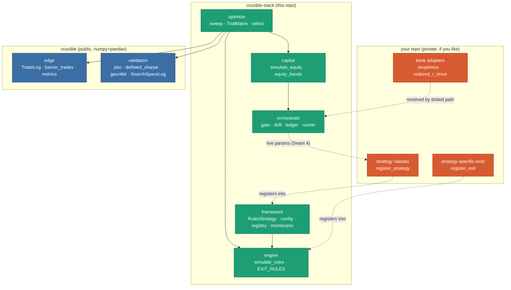

# Architecture

Three repos, one rule: **dependencies point downward and never back up.**

```
your strategies  ->  crucible-stack  ->  crucible
   (private, if you like)  (this repo)     (verdicts)
```

`crucible` answers *is this edge real?* for one set of trades. `crucible-stack` is
everything around that verdict: how you define a strategy, search its parameters honestly,
size it into an account, and keep it honest once deployed. Your strategies sit on top and
are the only part that has to be secret.

The framework never imports a strategy. That is checked by `tests/test_boundaries.py`, not
left to discipline, and the guard is mutation-tested so it fails when the boundary actually
breaks rather than only when someone remembers to look.

There is a second guard, and it exists because of where the leaks actually were.
`test_boundaries.py` reads the syntax tree, so it cannot see a docstring or a markdown
file, and every leak found while extracting this framework came through prose rather than
through an import. `tests/test_no_findings_in_prose.py` scans the writing for the shape of a
*result*: money, measured edges, private identifiers, and verdicts attached to a named book.
Generic prose about what clears the gate is fine. Reporting which book did is not.

## The layering



The dotted arrows are the whole design. **Nothing in this repo points up into yours.**
Strategies, exit rules and book adapters arrive by registration or by dotted-path lookup,
so the framework can be installed, tested and published without any of them existing.

## What each package owns

| Package | What it provides | Key entry points |
|---|---|---|
| **`framework`** | How you *declare* a strategy: the `RulesStrategy` ABC, the pydantic config schema, the strategy registry, and the block-bootstrap Monte Carlo engine. Ships `STRATEGY_REGISTRY` **empty**. | `RulesStrategy`, `register_strategy`, `get_strategy`, `load_config`, `MasterConfig`, `monthly_returns`, `block_bootstrap_paths` |
| **`engine`** | The rules simulator (per-trade R-multiple event sim) and a pluggable **exit/stop registry**. Generic rules ship here (`barriers`, `channel`, `atr_trail`); anything reading a strategy's own columns registers from outside. | `simulate_rules`, `register_exit`, `get_exit`, `EXIT_RULES`, `DEFAULT_EXIT_MODE` |
| **`optimize`** | **Seam 1.** Run a parameter search, record *every* variant in a `SearchSpaceLog`, and hand the result to crucible for a verdict that prices the search. Pluggable `simulate` hook and pluggable objective. | `sweep`, `TrialMatrix`, `select`, `Selection`, `rules_simulator`, `OBJECTIVES` |
| **`capital`** | **Seam 3.** Where currency first enters. Consumes a crucible `TradeLog` plus a sizing model and produces an `EquityResult`: the equity path, its stats, and bootstrap bands. The 1R-to-currency denominator lives here and never below. | `simulate_equity`, `EquityResult`, `equity_bands`, `EquityBands` |
| **`orchestrate`** | **Seam 4.** The deployment loop, and the only package that is a *service* rather than a library: it owns a clock, durable state and the live parameter set. A gate that fails closed, a drift monitor against a frozen envelope, a ledger, and triggers. | `run_cycle`, `evaluate`, `check_drift`, `DeploymentLedger`, `python -m crucible_stack.orchestrate` |

## The two ideas the design is built around

**The search is part of the result.** If you try 400 variants and report the best one's
Sharpe, you have reported the maximum of 400 draws. `optimize` keeps a `SearchSpaceLog` of
every variant genuinely tried and feeds that count into the corrections. This was a real
bug here before it was a principle: the ledger existed for a release without ever reaching
`deflated_sharpe`, which derived N from the configs it happened to be handed. See
[ADR-0002 in crucible](https://github.com/mspinola/crucible) and the 0.3.0 release notes.

**A deployed strategy is not a finished one.** `orchestrate` treats deployment as a loop
that keeps re-earning its place. Two asymmetries are deliberate: **the gate fails closed**
(no verdict means no promotion) and **triggers fail open** (a broken trigger causes a
needless re-optimization, not a missed one). See
[ADR-0003](adr/ADR-0003-deployment-orchestrator-as-stateful-reoptimization-loop.md).

## The seams

Four typed handoffs, documented in [design/seam-contracts.md](design/seam-contracts.md):

| Seam | Type | Between |
|---|---|---|
| 1 | `TrialMatrix` | search -> verdict |
| 2 | `TradeLog` (crucible) | simulator -> everything |
| 3 | `EquityResult` | R-space -> currency (owns `r_denominator`) |
| 4 | `DeploymentLedger` | verdict -> live params. The only **backward-flowing, stateful** seam |

Seam 2 is crucible's, which is what makes the R-multiple pivot possible: everything below
`capital` is capital-free, so an edge can be judged without assuming an account size.

## Extending it

You do not fork this repo to add a strategy. You install it and register:

```python
from crucible_stack.framework import RulesStrategy, register_strategy
from crucible_stack.engine.exits import ExitRule, register_exit

@register_strategy("my_gold_trend")
class GoldTrend(RulesStrategy):
    ...

@register_exit
class MyRegimeExit(ExitRule):
    name = "my_regime"        # reads whatever columns your frame has
    ...
```

The config schema extends the same way. `MasterConfig.strategy_space` is typed
`Optional[Any]` on purpose, so your parameter block is yours: subclass `MasterConfig`,
narrow the field to your own model, and pass it as `load_config(path, model=YourConfig)`.
An earlier version of this schema *required* fields named for one strategy's world, which
meant every unrelated strategy had to declare them. That is the failure mode the registries
and this field are both shaped to avoid.

## Further reading

- [toolchain.md](toolchain.md), the end-to-end guide: why you would run this, and how
- [orchestrate.md](orchestrate.md), operating the deployment loop
- [api-stability.md](api-stability.md), what is public, and what may change when
- [design/seam-contracts.md](design/seam-contracts.md), the four seam contracts in detail
- [adr/](adr/), the decision records, including why this repo exists at all
