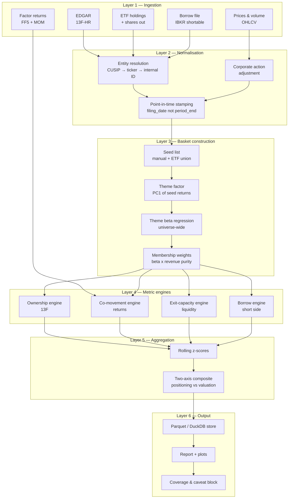

# crowdmon — Positioning Crowding & Exit-Capacity Monitor

**System description v0.1** · Python scaffold · single-user research tool

---

## 1. Purpose

Produce a daily, comparable-over-time estimate of **how crowded a user-defined equity basket is** and **how expensive it would be for the crowd to leave**, using free or near-free data.

The output is a *conditioning variable*, not a signal. It is intended to inform position sizing, stop calibration, hedge selection, and the decision not to re-gross into a theme — it does not predict direction and must never be wired to one.

Primary use case: thematic baskets with no clean sector definition (AI, obesity/GLP-1, defence, uranium), where membership must be constructed before positioning can be measured.

### Goals

| # | Goal |
|---|------|
| G1 | Construct a continuous, revisable basket definition from a seed list + return-space evidence |
| G2 | Measure ownership concentration and manager-to-manager holdings overlap |
| G3 | Measure return-space co-movement (residual correlation, variance absorption) |
| G4 | Measure exit capacity — days-to-liquidate, impact cost, liquidity commonality |
| G5 | Keep valuation crowding and positioning crowding as separate axes |
| G6 | Be honest about the blind spots at the point of output, not in a footnote |

### Non-goals

- Not a backtester or alpha model. No signal generation, no P&L attribution.
- Not real-time. Daily bar granularity, EOD batch.
- Not an execution or order management system.
- No short-book reconstruction (see §8 — this is the largest known gap).
- No portfolio optimiser integration in v0.1.

---

## 2. High-level design



**Cadence mismatch is a first-class design concern.** Layers producing daily output (D2, D3) and quarterly output (D1) must not be blended into a single smoothed series — see §6.3.

---

## 3. Layer detail

### 3.1 Ingestion

| Source | Content | Frequency | Lag | Cost |
|---|---|---|---|---|
| SEC EDGAR 13F-HR | US long equity holdings, managers above the 13F reporting threshold | Quarterly | 45d | Free |
| OHLCV vendor | Price, volume, shares out | Daily | 1d | Free–low |
| ETF holdings | Thematic basket membership | Daily | 1d | Free |
| IBKR shortable file | Shares available, borrow fee | Daily | 1d | Free |
| FINRA short interest | Reported SI by name | Bi-monthly | ~9d | Free |
| Ken French library | FF5 + momentum factor returns | Daily | ~1m | Free |

Each ingester implements a common interface: `fetch(as_of) -> RawFrame`, writes raw payloads to an immutable landing zone before parsing. Never parse in the fetch step — reprocessing history without re-hitting the source is worth the disk.

Rate limiting and a persistent local cache are mandatory for EDGAR (it will block you otherwise). Declare a real User-Agent.

### 3.2 Normalisation

The unglamorous layer where most of the correctness lives.

- **Entity resolution.** 13F reports CUSIP; everything else reports ticker. CUSIPs change on corporate actions, tickers get recycled. Maintain a `security_master` with validity intervals and resolve as-of. Log unmatched holdings as a coverage metric rather than dropping them silently — an unexplained jump in the unmatched rate is usually the first sign of a broken quarter.
- **Point-in-time stamping.** Index every 13F record by *filing date*, never period end. Using period end embeds a 45-day lookahead that will make every historical metric look prescient.
- **Corporate actions.** Split- and dividend-adjust returns; do *not* split-adjust reported share counts retroactively without also adjusting the price used for the dollar conversion.

### 3.3 Basket construction

Three-stage, because binary membership is too crude for a theme:

1. **Seed** — union of thematic ETF holdings plus a manual list, weighted 1/N.
2. **Theme factor** — first principal component of seed-basket daily returns, sign-oriented to the largest loading. Optionally orthogonalise against the market to get a clean thematic axis.
3. **Theme beta** — rolling (250d) regression of every universe name on the theme factor, controlling for market. Yields continuous `theme_beta[name, date]`.

Final membership weight = `theme_beta × revenue_purity`, where revenue purity is a manually maintained 0–1 estimate of the share of revenue exposed to theme demand. This is manual and it is where most of the analytical value sits — cap-weighted thematic baskets are dominated by names for whom the theme is a rounding error.

**Second-order output worth surfacing:** the *time derivative* of `theme_beta`. A name whose theme beta is rising is increasingly being traded as an expression of the theme rather than as a company. That drift is itself a crowding indicator, and it is observable before any 13F confirms it.

---

## 4. Metric engines

### 4.1 Ownership engine (quarterly)

| Metric | Definition | Reads as |
|---|---|---|
| HF ownership share | Σ cohort shares / free float | Level of institutional-speculative ownership |
| Breadth | Count of cohort managers holding, scaled | How widely the idea has spread |
| Pairwise overlap | Cosine similarity of manager weight vectors, cohort-restricted | Whether managers are converging on one book |
| Ownership HHI | Herfindahl across holders | Concentration vs dispersion of the holding base |
| Position-to-float | Largest holder shares / float | Single-holder exit risk |

Cohort definition is a manual CIK whitelist. There is no reliable automatic hedge-fund classifier in EDGAR metadata; attempting one produces a cohort polluted with pensions and RIAs, which dilutes exactly the signal being measured.

### 4.2 Co-movement engine (daily)

- **Residual correlation.** Regress each basket name's daily excess return on FF5 + MOM (optionally + theme factor); compute mean pairwise correlation of residuals on a rolling 60d window. Rising residual correlation means the names' "idiosyncratic" returns are not idiosyncratic — they are one shared position. This is the quantification of *"adverse idiosyncratic moves"*.
- **Absorption ratio.** Share of basket return variance explained by the top-k eigenvectors of the rolling covariance matrix (Kritzman/Li). Report level and 15-day change; the change is the fragility indicator.
- **Eigenvector stability.** Rotation of PC1 loadings over time. Sudden rotation means the market has redefined what the theme is.
- **Downside asymmetry.** Rolling skew and downside/upside realised-vol ratio. Crowded names develop fatter left tails before they break.
- **Unwind mirror.** Construct the canonical quant book (long quality/value, short short-horizon-reversal winners) and correlate the basket's return against it. Separates "the theme fell because of fundamentals" from "the theme fell because quant books were deleveraging".

### 4.3 Exit-capacity engine (daily) — see §5

### 4.4 Borrow engine (daily)

Utilisation (`shares on loan / lendable`), fee rate, and fee-rate momentum. On the short side, borrow scarcity *is* the liquidity constraint: a fully utilised borrow means the exit timing is set by recall, not by the manager.

---

## 5. Measuring liquidity — the exit-capacity module

Liquidity here is not "can I trade this name" but **"can the crowd leave through the door that exists"**. Every metric is therefore a ratio of collective position to absorbable flow.

### 5.1 Volume-based capacity

**Days-to-liquidate**

```
DTL = crowded_shares / (participation_rate × ADV_stress)
```

- `crowded_shares` — cohort 13F holdings (long side) or reported short interest (short side)
- `participation_rate` — 0.20 default; the share of daily volume you can take without dominating the tape
- `ADV_stress` — see §5.4

Days-to-cover (`SI / ADV`) is the same statistic on the short side and is the one that mattered in the July episode.

Report per name and as a liquidity-weighted basket aggregate. The distribution matters more than the mean: a basket with one 15-day name and forty 0.5-day names is a different risk than a uniform 1.5-day basket, because the 15-day name sets the price during a coordinated exit.

### 5.2 Impact-based cost

The square-root law converts size and volatility into an estimated cost in basis points:

```
impact_bps ≈ Y × σ_daily × sqrt(Q / ADV) × 10_000
```

with `Y ≈ 0.5–1.0` calibrated per venue, `Q` the shares to be exited. This is the single most useful line of output the system produces, because it is denominated in the units the decision is actually made in.

Note the σ term: impact scales with volatility. Crowding and volatility are multiplicative, not additive — which is why these episodes are always short and deep rather than long and shallow.

### 5.3 Spread and impact proxies (daily data only)

| Estimator | Input | Measures |
|---|---|---|
| Amihud illiquidity | `mean(|r| / dollar_volume)` | Price impact per dollar traded |
| Corwin–Schultz | Daily high/low | Effective bid-ask spread |
| Abdi–Ranaldo | High/low/close | Spread, lower bias than C-S |
| Roll implied spread | Serial covariance of returns | Spread, noisy on illiquid names |
| Turnover | `ADV / float` | Days for the float to turn once |

Kyle's lambda is the correct microstructure measure but requires signed order flow from tick data — out of scope for a free-data scaffold. Amihud is the standard daily-data stand-in and is adequate for cross-sectional and time-series comparison.

### 5.4 The two adjustments that matter most

**Stress-conditioned ADV.** Calm-market volume systematically overstates capacity. Compute ADV over the worst decile of market days in the trailing two years, not over all days. Expect it to be materially lower than headline ADV for crowded names.

**The volume-spike trap.** During a selloff, volume explodes. Naively computed DTL therefore *falls* — the system reports improving liquidity at the exact moment liquidity is being consumed. This is the most dangerous failure mode in the design. Mitigations: use a trailing median rather than mean, freeze the ADV denominator to a calm-regime baseline during flagged stress windows, and surface realised vs baseline volume as a separate diagnostic instead of letting it silently improve the ratio.

**Liquidity commonality.** Regress each name's daily liquidity change on the basket-average liquidity change (Chordia–Roll–Subrahmanyam). High commonality means the exits close simultaneously — the individual DTLs cannot be treated as independent, and the basket-level exit is worse than the sum of its parts. This term is what actually distinguishes crowded-and-liquid from crowded-and-illiquid, and it is routinely omitted.

### 5.5 Composite

```
exit_pressure = DTL_stress × liquidity_commonality_multiplier
exit_cost_bps = impact_bps summed over the basket, weighted by crowded_shares
```

Both are reported as rolling percentiles against their own history, never as absolute thresholds.

### 5.6 Honest limits of the liquidity estimate

- Liquidity is **endogenous**. Realised capacity during an unwind depends on who else is exiting — the quantity being measured. DTL is therefore a *lower bound on pain* and is systematically optimistic.
- Short positions **grow as they lose**. A short that moves 200% against you triples in weight with no trade, so exit capacity required grows super-linearly while available capacity is falling. DTL computed at entry can understate the true requirement by a factor of three or more.
- Free float is an estimate, and passive holders do not sell, so effective float during a stress exit is smaller than reported float.
- No cross-venue, dark pool, or ADR/local-line fungibility modelling.

---

## 6. Aggregation and output

### 6.1 Two axes, deliberately not merged

- **Valuation crowding** — the theme is expensive. Persists for years; near-useless for timing.
- **Positioning crowding** — the theme is owned, levered, and large relative to exit capacity. This is what unwinds violently.

Collapsing them into one number destroys the distinction that makes the tool useful.

### 6.2 Scoring

Each component z-scored on a trailing 3-year window, winsorised at ±3, then combined with explicit configured weights. Percentile rank against own history is the reported form; raw levels are not comparable across baskets.

### 6.3 Cadence handling

Ownership metrics are step functions that update on filing dates. Do not interpolate or forward-smooth across a filing date — that leaks future information backwards. Carry the last known value forward flat and render the staleness (days since filing) alongside every ownership metric.

### 6.4 Output artefacts

- `crowdmon.duckdb` — metric store, one row per (basket, date, metric)
- Report: composite time series, per-name DTL distribution, residual correlation and absorption overlays, borrow tightness
- **Coverage block** on every report: % of basket by weight with 13F coverage, staleness in days, unmatched-CUSIP rate, and the standing blind-spot list from §8. Caveats belong on the output, not in a README nobody opens.

---

## 7. Use cases — the retail workflow

A retail trader is not going to move a market, so the value of this system is not the same as it is for a fund risk desk. A fund uses it to decide how much of a crowded book it can carry. A retail trader uses it to **avoid being the marginal participant in someone else's unwind** — to size correctly, to choose protection that pays in a gap rather than triggering into one, and above all to correctly classify a drawdown while it is happening.

The tool finds very few trades. It prevents a specific and expensive category of mistake.

### UC-1 — "Should I add to this winner?"

*Trigger:* a thematic position is up substantially and the temptation is to add.

Check the positioning-crowding percentile and exit-pressure percentile for the basket. If positioning crowding is above the 90th percentile of its own history while valuation crowding has been elevated for months, the marginal buyer is arriving late into a position whose exit is already congested.

*Action:* do not add. Consider trimming into strength, or converting part of the position to a defined-risk call spread so that the upside is retained without the gap exposure. The asymmetry the system is flagging is not "this will fall" — it is "when it falls, it will fall through your stop."

### UC-2 — Stop placement and gap risk

*Trigger:* setting a stop on a name flagged as crowded.

**A stop is a trigger, not a guarantee.** It converts to a market order when touched and fills wherever the market next trades. In a crowded, high-DTL name that is exactly the moment the book is thin, so the fill arrives below the level, and it arrives *because* the cascade has started rather than before it. UC-1 states the same fact from the other side: the asymmetry the system flags is "when it falls, it will fall through your stop." Widening the stop does not change that. It changes where you find out.

So the choice is not tight versus wide. It is between what protects and what merely triggers. Use the downside-asymmetry metric (§4.2) and the square-root impact estimate (§5.2) to price the gap explicitly, since §5.2 is denominated in the units the decision is actually made in.

*Action:* on the names the system flags, prefer **defined-risk protection**: a long put, or a collar where the premium is unattractive on its own. That converts an unknown slippage into a known premium, and it is the only structure that pays *in* the gap rather than transacting into it. Where a stop is the only available tool, size the position so that a gap through the level is survivable, rather than sizing to the stop distance, because the stop distance is not what determines the loss.

**Widening is a trade-off with two sides, not an improvement.** A wide stop keeps you in a *positioning unwind*, which UC-6 says usually mean-reverts, and it costs you more in a *fundamental repricing*, which UC-6 says does not. Which of the two you are in is UC-6's question, and it is answerable while the drawdown is happening, so that decision belongs there rather than being assumed here.

The system's contribution is telling you *which* names need this treatment. Applying it everywhere is just expensive.

### UC-3 — Short-side screening

*Trigger:* considering a short.

Run days-to-cover, borrow utilisation, and fee rate before anything else. Utilisation above ~90% with a rising fee and DTC above roughly five days is the standard squeeze configuration: the exit is narrow and the timing of your exit may not be yours to choose, because recall forces it.

*Action:* if the borrow is tight, express the view with puts rather than a short. A retail short has no negotiated borrow, no term, and no leverage cushion — this is the single most likely way for a retail account to be destroyed by a crowding episode, and it is entirely avoidable with a pre-trade check.

### UC-4 — Theme purity check

*Trigger:* about to buy "an AI play".

Look at the name's theme beta and revenue purity (§3.3). Two failure patterns show up immediately: buying a company where the theme is a rounding error on revenue but the multiple has already been re-rated as if it were not, and buying a name whose theme beta has been *rising* — meaning the market has begun trading it as an expression of the theme rather than as a business.

*Action:* rising theme beta means you are buying correlation, not a company. Fundamental analysis of that name has lost most of its explanatory power over the next twelve months, and the position should be sized as a theme bet.

### UC-5 — Audit your own portfolio's crowding

*Trigger:* quarterly review. Arguably the highest-value use in the whole list.

Run the co-movement engine (§4.2) on **your own holdings** instead of on a market basket. Compute the absorption ratio of your personal portfolio: the share of your portfolio's variance explained by its first principal component.

Retail portfolios routinely consist of eight to twelve positions that are, in risk terms, one trade — bought at different times for different reasons, all loading on the same factor. A reading like "78% of your portfolio variance sits in PC1, and PC1 correlates 0.9 with the AI basket" is a concrete, unarguable diagnosis that no amount of position counting will produce.

*Action:* diversify against the measured factor, not against sector labels or share counts.

### UC-6 — Classifying a drawdown while it is happening

*Trigger:* a position is down sharply and the decision is hold or fold.

This is where the unwind-mirror metric (§4.2) earns its place. It separates two situations that feel identical in the moment and demand opposite responses:

| Signature | Reading | Response |
|---|---|---|
| Basket falls, residual correlation spikes, unwind-mirror correlation high, no news | Positioning unwind. The signal did not break; capacity did. | Usually holds and mean-reverts. Do not panic-sell at the bottom of a deleveraging cascade. |
| Basket falls, residual correlation flat, dispersion *rises*, name-specific news | Fundamental repricing. Individual theses are being marked. | Re-underwrite the position. Reversion is not the base case. |

Behaviourally this is the most valuable output the system produces, because the standard retail error is to exit a temporary technical unwind at the low and then miss the recovery — while holding through the fundamental repricing that actually required an exit.

### UC-7 — Timing re-entry after an unwind

*Trigger:* the theme has fallen hard and is stabilising.

The re-grossing dynamic (§1) means positioning rebuilds after a drawdown and the crowded state reconstitutes. The favourable entry window is when the composite has fallen out of the extreme *and* liquidity metrics have normalised — the crowd has actually left, rather than merely being underwater and still holding.

*Action:* enter when crowding is low and improving, not when price is low and crowding is unchanged. A price that has fallen with positioning intact is a position waiting for its second leg down.

### UC-8 — Event sizing

*Trigger:* earnings or a scheduled catalyst on a crowded name.

Crowded plus illiquid plus a binary event is the configuration that produces outsized gaps, because the event provides the common trigger that synchronises the exit. Reduce size into the print or take defined-risk exposure.

### Cadence and discipline

Weekly is the right review frequency for the daily metrics; quarterly for the ownership metrics, which only update on filing dates anyway. Checking daily invites over-trading on noise, and the underlying data does not move fast enough to justify it.

Two standing rules keep this honest:

- **Never trade the composite directly.** It has no directional content. Every use above is a sizing, structuring, or classification decision applied to a view arrived at independently.
- **A high reading can persist for quarters.** It is a statement about the tail, not about next week.

---

## 8. What this system does not measure

Stated prominently because every one of these can invert the conclusion.

1. **Shorts.** 13F is long-only. The July drawdown described in the source article was driven by the short book. Short interest and borrow data are partial substitutes; neither tells you *who* is short or how correlated the short books are.
2. **Swaps and total return swaps.** Synthetic exposure is invisible. Post-Archegos this is a large and growing share of hedge fund equity exposure.
3. **Options.** Delta and gamma exposure, and dealer hedging flow, are not modelled in v0.1. Open interest and skew are candidates for v0.2.
4. **Leverage.** 13F gives gross long holdings, not gross or net exposure. A manager cutting gross by half is invisible until the next filing.
5. **Non-US positioning.** No 13F equivalent for Korea, Japan, Taiwan, or Europe. Retail margin balances (KOFIA, TWSE) are partial regional substitutes. For a theme like AI, this excludes a large fraction of the actual position.
6. **Sub-threshold and non-filing holders.** Managers below the 13F reporting threshold, family offices, sovereigns, and non-US filers.
7. **Intra-quarter dynamics.** A position opened and closed inside a quarter never appears at all.
8. **Direction and timing.** The system describes the shape of the tail, not which way the next move goes. High readings can persist for quarters.
9. **Causality.** Every metric is an association. A rising composite is consistent with crowding and also with a genuine sector-wide fundamental repricing.

---

## 9. Failure modes and validation

| Failure mode | Symptom | Mitigation |
|---|---|---|
| Lookahead via period_end | Metrics look prescient historically | Enforce filing-date indexing in a test |
| Volume-spike trap | Liquidity "improves" during selloff | Frozen calm-regime ADV baseline |
| Entity resolution drift | Sudden coverage drop | Unmatched-rate alert per quarter |
| Seed-list survivorship | Basket looks great historically | Point-in-time seed list with add/remove dates |
| Cohort pollution | Overlap metric goes flat | Manual CIK whitelist, reviewed quarterly |
| Silent source schema change | Empty frames, no error | Row-count and null-rate assertions per ingester |

**Validation:** replay against known episodes and check the composite elevates *before* the drawdown, not during it — August 2007 (quant quake), January 2021 (short squeeze), August 2024 (carry unwind), June–July 2025 and January 2026 quant drawdowns. A metric that only spikes coincidentally with losses is a lagging indicator dressed up as a warning.

---

## 10. Stack and layout

Python 3.11+ · pandas or polars · numpy · statsmodels · scikit-learn (PCA) · requests · lxml · pyarrow · duckdb · matplotlib · pydantic (config) · pytest

```
crowdmon/
  config/          basket definitions, cohort CIKs, params (YAML)
  ingest/          one module per source, common fetch interface
  normalize/       security master, corporate actions, PIT stamping
  basket/          seed, theme factor, beta regression, weights
  metrics/
    ownership.py   overlap, breadth, HHI
    comovement.py  residual corr, absorption, asymmetry
    liquidity.py   DTL, Amihud, Corwin-Schultz, impact, commonality
    borrow.py      utilisation, fee
  aggregate/       z-scores, composite, percentile ranks
  report/          plots, coverage block
  store/           duckdb + parquet
  tests/
  cli.py
```

**Deployment note:** intended to run on a local machine. The Claude analysis container's network egress is restricted to package registries, so EDGAR, price vendors and the French library are unreachable from there. The scaffold will be built with a fixture-based offline test path so the logic can be validated in-container and the live fetch run locally.

---

## 11. Build order

1. Store, config, security master, EDGAR ingester + PIT stamping *(the hard part — do it first)*
2. Ownership engine → overlap matrix
3. Price ingester → co-movement engine
4. Liquidity engine
5. Aggregation, report, coverage block
6. Borrow engine, historical episode validation

Steps 2 and 4 are the two the earlier conversation identified as delivering most of the value on free data; step 1 is unavoidable prerequisite plumbing for step 2.

---

## 12. Companion: futures / COT adapter

See `crowdmon_futures_cot_module.md` (in the `cotdata` repo, under `docs/design/`).

> **Status 2026-07-30.** Step 1 of the futures adapter is built: as-published (vintage) COT
> capture with change-only storage, field-level revisions carrying revision depth,
> point-in-time `asof(t)` reads, and release dates with explicit provenance. It lives in
> `cotdata` (branch `claude/cot-revision-snapshots-9b196f`,
> [PR #78](https://github.com/mspinola/cotdata/pull/78)); the scope and persistence decision
> is [ADR-0008](../adr/ADR-0008-cot-vintage-provenance-in-parquet.md), which ships in this
> same PR.
>
> Two outcomes bear directly on the shared components below:
>
> - **No DuckDB.** The store is Parquet plus a JSON manifest. Change-only writes keep the
>   entire vintage history in single-digit MB, and DuckDB can still query those files ad hoc
>   without becoming the storage format. Read "the DuckDB/parquet store" below as Parquet.
> - **Vintage history is forward-only.** CFTC serves current state only and git-history
>   recovery returned nothing, so point-in-time protection begins at first capture and can
>   never be backfilled. Any validation (§9) resting on as-of correctness over history that
>   predates capture is permanently unavailable, not merely pending.

**Current priority: the futures adapter is the primary build; this equity monitor is the follow-on.** COT resolves the four structural weaknesses of the 13F approach — it reports shorts explicitly, arrives weekly with a three-day lag, describes a zero-sum system where open interest is known exactly rather than estimated against float, and publishes trader counts and concentration ratios directly.

**Shared components** (build once, consume from both): the DuckDB/parquet store, the rolling z-score and percentile aggregation layer, the report and coverage-block layer, and the impact-cost core of the exit-capacity engine (§5.2, §5.4 — the square-root law and the stress-conditioned ADV / volume-spike-trap handling apply unchanged to futures).

**Distinct components:** ingestion, the contract master standing in for the security master, the positioning engine replacing the ownership engine, and the CTA response function, which has no equity equivalent because systematic equity capital is not replicable to comparable fidelity.

Practical consequence for this document: §3.1–3.2 (EDGAR, security master) and §4.1 (ownership engine) are deferred. §4.2, §5 and §6 should be implemented generically enough to serve both asset classes rather than being written against equity inputs.
